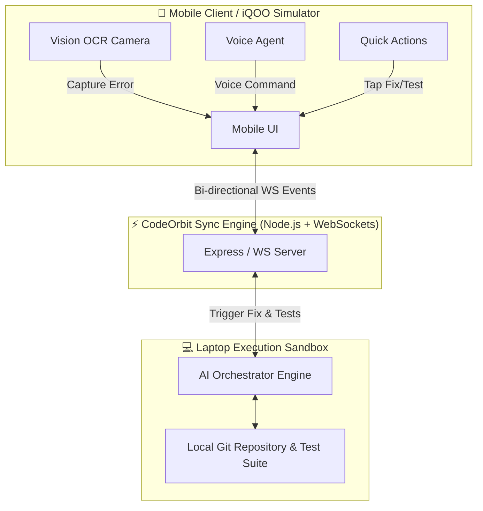

<div align="center">

  <h1>⚡ CodeOrbit AI</h1>
  <p><b>Your Phone-First AI Development Command Center</b></p>

  <p><i>Understand code. Debug faster. Review smarter. Fix with confidence.</i></p>

  [](https://github.com/vedant21-oss/CodeOrbit)
  [](https://react.dev/)
  [](https://www.typescriptlang.org/)
  [](https://vitejs.dev/)
  [](https://tailwindcss.com/)
  [](https://developer.mozilla.org/en-US/docs/Web/API/WebSockets_API)

</div>

---

## 🚀 Overview

**CodeOrbit AI** is a next-generation, mobile-first developer command center engineered for modern developers on the move. By bridging your local laptop execution environment with a responsive mobile interface, CodeOrbit lets you analyze repositories, run security audits, debug stack traces via camera OCR, execute tests remotely, and review PRs using voice commands—all in real-time.

Built specifically for the **iQOO Hackathon (Developer Tools Track)**, CodeOrbit features a dual-view environment with an integrated **iQOO 13 Pro 5G Simulator**, bi-directional WebSocket state sync, and a multi-provider AI reasoning engine.

---

## ✨ Key Features

### 📱 1. Phone-First Developer Experience
* **iQOO 13 Pro Simulator**: Test and interact with the full mobile developer experience directly in your browser.
* **Touch-Optimized Workflows**: One-tap fix generation, instant PR reviews, and mobile test execution.

### ⚡ 2. Real-Time Dual-Device Synchronization
* **WebSocket Sync Engine**: Live bi-directional event stream connecting mobile devices to the laptop test runner.
* **Instant State Reflection**: Actions taken on phone (e.g., triggering a fix or test suite) instantly execute on the laptop and reflect on desktop console.

### 📸 3. Vision OCR Error Scanner
* **Screen Error Capture**: Snap a photo or scan screen logs directly using your phone's camera.
* **Automated Log Parsing**: Extracts stack traces and feeds them into the AI reasoning orchestrator to locate root cause files automatically.

### 🎙️ 4. Voice-Driven AI Assistant
* **Voice Agent Modal**: Hands-free control with natural voice commands like *"Fix payment bug"*, *"Run unit tests"*, or *"Audit PR security"*.

### 🧠 5. AI Debugger & Git Patch Generator
* **Root Cause Diagnostics**: Deep automated analysis pinpointing exact file paths, line numbers, and error triggers.
* **Side-by-Side Diff Viewer**: Inspect generated Git patches before applying fixes to your codebase with a single click.

### 🧪 6. Laptop Test Execution Sandbox
* **Remote Test Triggering**: Run unit and integration tests hosted on your laptop execution environment directly from mobile.
* **Live Step Progress**: Track real-time test progress, execution percentages, and pass/fail reports.

### 🛡️ 7. Security Agent & OWASP Audits
* **Vulnerability Scanning**: Automatic detection of unsafe input validation, SQL injections, and secret leaks.
* **Remediation Recommendations**: One-click automated patch application for security vulnerabilities.

### 📊 8. Interactive Codebase Graph
* **Module Dependency Mapping**: Visual interactive node graph mapping system dependencies, APIs, and module interactions.

---

## 🏗️ System Architecture



---

## 🛠️ Tech Stack

| Domain | Technology |
| :--- | :--- |
| **Frontend Framework** | React 19, TypeScript, Vite |
| **Styling & UI** | Tailwind CSS v4, Lucide Icons, Custom Glassmorphism Theme |
| **Backend & Sync** | Node.js, Express, WebSockets (`ws`), `tsx` |
| **AI Orchestration** | Multi-Provider Engine (Gemini 1.5 Pro, Claude 3.5, DeepSeek V3, Local Ollama) |
| **Developer Tools** | Git, PostCSS, Autoprefixer |

---

## 📂 Project Structure

```
CodeOrbit/
├── server/
│   └── server.ts           # Real-time Express & WebSocket sync server
├── src/
│   ├── components/         # Desktop Console & iQOO Mobile Simulator UI components
│   │   ├── AIDebuggerView.tsx
│   │   ├── CameraScannerModal.tsx
│   │   ├── CodebaseGraphView.tsx
│   │   ├── CommandPaletteModal.tsx
│   │   ├── DashboardView.tsx
│   │   ├── FixDiffViewer.tsx
│   │   ├── Header.tsx
│   │   ├── IQOOPhoneSimulator.tsx
│   │   ├── LandingPage.tsx
│   │   ├── MobileView.tsx
│   │   ├── PRReviewerCard.tsx
│   │   ├── RepositoryView.tsx
│   │   ├── SecurityAgentView.tsx
│   │   ├── Sidebar.tsx
│   │   ├── TestExecutionPanel.tsx
│   │   └── VoiceAgentModal.tsx
│   ├── demo-repo/          # Demo codebase & test runner for verification
│   ├── services/           # AI orchestrator & WebSocket sync services
│   ├── types/              # TypeScript interfaces & state models
│   ├── App.tsx             # Main application orchestrator
│   └── main.tsx            # React application entry point
├── index.html
├── package.json
└── vite.config.ts
```

---

## 🚦 Getting Started

### Prerequisites
* **Node.js** v18.0 or higher
* **npm** or **yarn**

### Installation

1. **Clone the Repository**
   ```bash
   git clone https://github.com/vedant21-oss/CodeOrbit.git
   cd CodeOrbit/CodeOrbit
   ```

2. **Install Dependencies**
   ```bash
   npm install
   ```

3. **Start the Frontend Application**
   ```bash
   npm run dev
   ```
   The web application will open at `http://localhost:5173`.

4. **Start the Real-Time Sync Server (Optional for Live WebSockets)**
   In a separate terminal:
   ```bash
   npm run server
   ```
   The WebSocket server runs on `http://localhost:3001`.

---

## 🎮 Hackathon Demo Flow

1. Open **CodeOrbit** in your browser (`http://localhost:5173`).
2. Toggle the **📱 Mobile Simulator** frame from the header to view the dual desktop/mobile interface.
3. Click **"Scan Error"** (Camera Scanner) or **"Voice Command"** on the mobile simulator.
4. Select **"Generate Fix"** to view the live Git patch generated by the AI orchestrator.
5. Click **"Run Tests"** to execute the test suite on the laptop sandbox and observe real-time progress.
6. Check the **Activity Log** tab to see real-time WebSocket sync events recorded across devices.

---

## 📜 License

Distributed under the MIT License. See `LICENSE` for more information.

---

<div align="center">
  <sub>Built with ❤️ for the <b>iQOO Hackathon — Developer Tools Track</b></sub>
</div>
